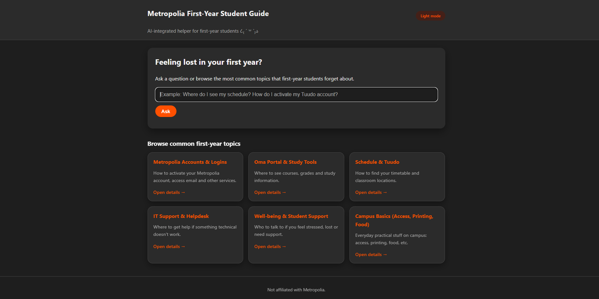
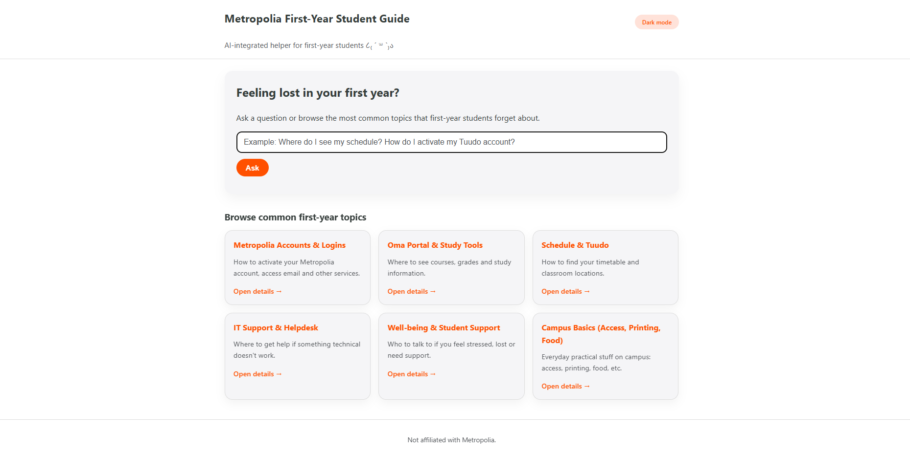
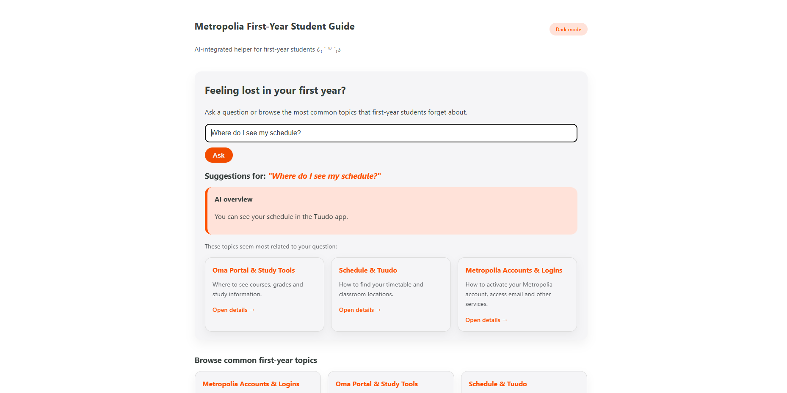

## Metropolia First-Year AI Helper

A lightweight Flask web app that helps first-year students at Metropolia University
of Applied Sciences find essential study information using AI-assisted question answering. The app combines a small curated knowledgebase
with an LLM through a Retrieval-Augmented Generation (RAG) approach to ensure answers stay in accordance to official student guidance.

The idea for this project stems from not only my personal experience as a first-year student but also of those who
came after me to study in Metropolia. New students always have a ridiculous amount of questions, and although the answers
may be found from official Metropolia services (e.g. Oma), the websites can be confusing for beginners. That is why
I wanted to create an app that helps students find their answers swiftly and with the assistance of an LLM.

### Features

- Ask study-related questions & receive an answer immediately

- Retrieval-based topic matching (RAG)

- AI responses via Groq free LLM API with llama 3.1 model

- Browsable topic cards

- Light/Dark mode with Metropolia brand colors

- Curated links to official platforms

### Tech

// **Backend**

- Python + Flask
- Gunicorn (production server)

// **AI**

- Groq API (free tier)
- LLaMA-3.1-8B-Instant model

// **Frontend**

- Jinja templates
- HTML + CSS
- Server-side light/dark mode toggle

// **Hosting**

- GitHub + Render

## Getting Started

The application is deployed in Render and can be accessed here https://metropolia-first-year-helper.onrender.com. You can also run
it locally according to this guide:

### **Prerequisites**

1. Install dependencies:

    ```bash
    pip install -r requirements.txt
    ```

2. Get a free API key from https://groq.com

3. Set Groq API key:

    ```sh
    setx GSK_API_KEY "gsk_your_key_here"
    ```

Installation

1.  Clone the repository:
    ```sh
    git clone https://github.com/marikraa/metropolia-first-year-helper.git
    ```

2. Run:

    ```sh
    python app.py
    ```

3. Visit http://127.0.0.1:5000

## Usage

On the landing page, the user can either ask a question or browse any of the topics shown below. The website
can also be switched between dark and light mode.





On the homepage, the user can type their question to the textfield, and they will receive an answer by an LLM as well as links to the topic cards
that best match with the asked question.



Upon clicking a topic card, the site will show relevant info regarding the topic's questions.


## Contact

Maria Aalto - Maria.Aalto4@metropolia.fi

Project Link: [https://github.com/marikraa/metropolia-first-year-helper.git](https://github.com/marikraa/metropolia-first-year-helper.git)